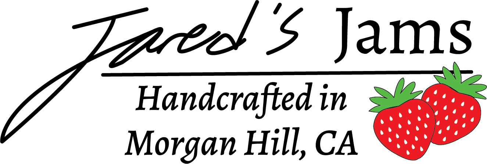

<!DOCTYPE HTML>
<html>

<head>

<meta charset=”UTF-8”>

<!-- THE TITLE WILL APPEAR IN THE BROWSER WINDOW OR TAB -->
<title>Jared's Jams</title>
<link rel="stylesheet" type="text/css" href="styles-contact.css">
<link rel="preconnect" href="https://fonts.googleapis.com"> 
<link rel="preconnect" href="https://fonts.gstatic.com" crossorigin> 
<link href="https://fonts.googleapis.com/css2?family=Roboto:ital,wght@0,100;1,900&display=swap" rel="stylesheet">
</head>

<body>
    

        
        <h1>Welcome to Jared's Jams</h1>
        <h2>We are a family owned and operated farm located in Morgan Hill, CA.</h2>
        
Come visit us at 21 Main St. Morgan Hill, CA 95037
        
        

<nav>
    <ul>
        <li><a href="Jared Jams Brochure.pdf">Brochure</a></li>
        <li><a href="http://www.calpoly.edu" target="blank">Cal Poly Website</a></li>
        <li><a href="mailto:jmmandre@calpoly.edu">Email Us</a></li>
    </ul>
</nav>

    
 <!--end of center div-->

</body>

</html>
